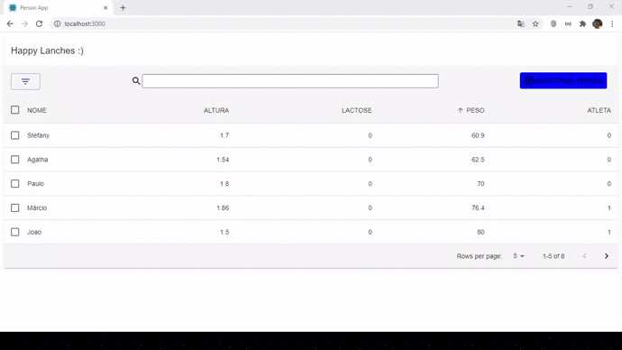

# Projeto Elofy
<div align="center">

</div>

- Este projeto foi desenvolvido para atender aos requisitos do processo seletivo da Elofy. A Stack escolhida para o desenvolvimento do projeto foi a pilha de tecnologias Javascript (com Typescript).

## Tecnologias utilizadas
1. React
2. NodeJS
3. Express
4. Typescript
## Bibliotecas utilizadas
1. Knex
2. Material - UI
3. React Router Dom
4. Cors
5. Axios

## Descrição da tarefa
- Uma empresa responsável por fazer lanches saudáveis para colaboradores guarda as informações referentes a essas pessoas em uma tabela em formato csv. A demanda deles e poder ter estas informações em uma aplicação que permita, consultar os dados e filtrá-los.
### Requisitos do exercício:
- Back-end: Utilizar banco de dados e serviços para consultar as informações.
- Front-end: Utilizar um dos layout sugeridos abaixo como referência . É importante que sejam utilizados padrões de cores, espaçamentos, font e ícones, independente do layout escolhido.
### Passos:
1. Criar uma aplicação capaz de ler uma tabela de pessoas em umbanco de dados qualquer e realizar filtros.
2. Listar essas informações em tabela simples. (conforme layout escolhido)
3. Permitir filtros.
### Filtros desejados:
- Pessoas acima do peso, no peso ideal e abaixo do peso.
- Pessoas altas, medianas, baixas
- Pessoas intolerantes a lactose
- Pessoas atletas

Utilizar tabela abaixo para a relação:
1. Altura
- 1,80 < Altos
- 1,60 - 1,79 - Medianos
- 1,59 > - Baixos
2. Peso
- 90 < - Acima do peso
- 70 - 89 > Peso ideal
- 69 > Abaixo do peso


## Resultado parcial
<div align="center">

</div>

## Futuras implementações
- [x] Buscar pessoas do banco de dados
- [x] Filtragem dos dados
- [ ] Cadastrar pessoa
- [ ] Barra de busca

## Execução do projeto do Frontend
- Para executar o projeto do frontend basta executar os seguintes comandos:
1. ```yarn install```
2. ```yarn start```

## Execução do projeto do Backend
- Para executar o projeto do backend basta executar os seguintes comandos:
1. ```yarn install```
2. ```yarn dev```

obs:Dev é um script que inicializa o ts-node-dev (Veja o arquivo package.json)
